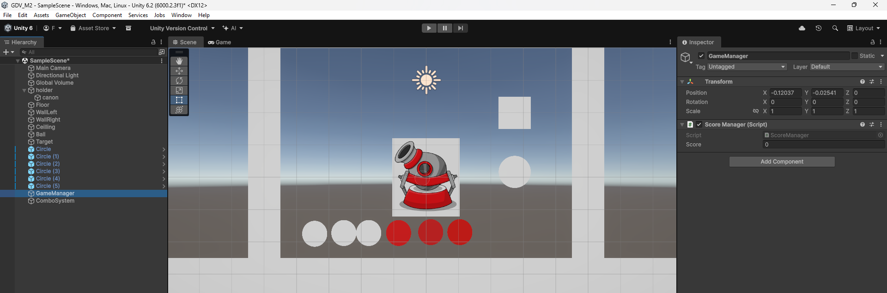
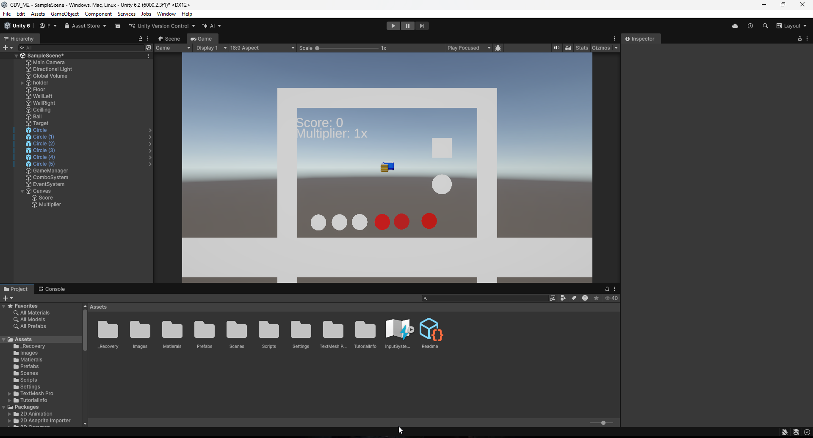
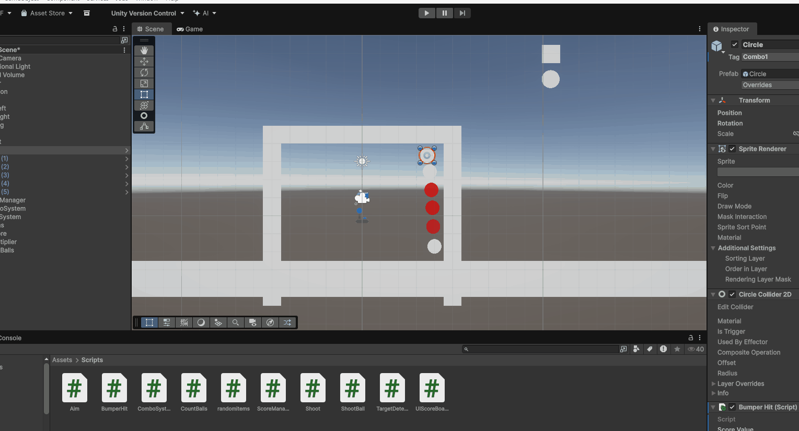
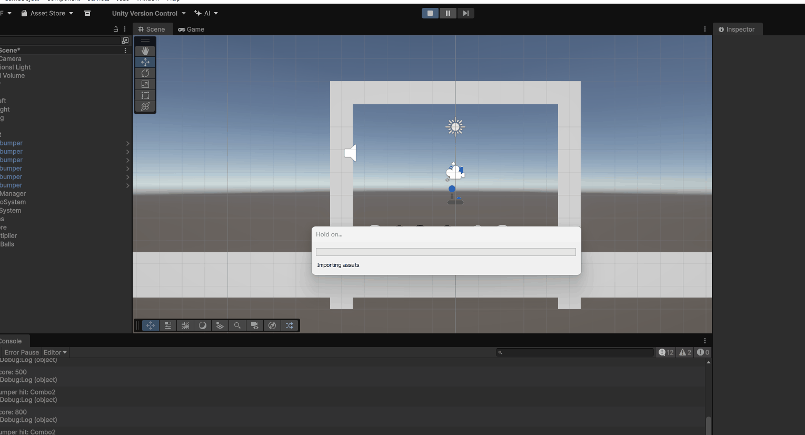

# GDV_M2

---

# Inhoud

- [Link naar lessen](#link-naar-lessen)
- [1.1 GameConcept](#11-gameconcept)
- [1.2 Randomitems](#12-random-items)
- [2.1 BallForce](#21-ball-collision-en-force)
- [2.2 Canon](#22-peggle-mikken-line-renderer)
- [3.1 Scoremanager](#31-score--triggers)
- [3.2 Combo](#32-peggle-game-combos-multiplier-events)
- [4.1 UI](#41-ui)
- [4.2 Score versturen](#42-score-versturen)
- [5.2 Particles, Sound en Shakes](#52-particles-sound-en-shakes)

---

# Link naar lessen

https://github.com/djsjollema/lessen-gamedevelopment/tree/main/M2/GDV

# 1.1 GameConcept

## Titel game: PinDrop

## Genre

Physics-based arcade puzzelgame.

## Beschrijving

De speler moet een pin schieten op ballonnen en sommige zijn stenen en dan bounced ie ergens naartoe en hij valt op een stukje van een houtboord. De speler heeft 1 pin. als de pin een lucky ballon hit dan krijgt die nog een pin en kan je de scoren verhogen. als de pin de grond aanraakt dan word de definitieve score uitgerekend. Als de pin een minimale score heeft behaald dan word het level reset en moet je een hogere scoren krijgen

---

# 1.2 Random items

Beschrijving: Herhaling van datatypes en we hebben met private gewerkt en random items in de console laten appearen als je op een bepaald knop klikt. ik heb nmr1 voor een willekeurig item, en nmr 2 voor alle items.

Script: [Randomitems.cs](Assets/Scripts/randomitems.cs)

---

# 2.1 Ball collision en force

Beschrijving: Een omgeving gemaakt voor de bal om te bouncen en te detecteren of de target gehit word

Scripts [ShootBall.cs](Assets/Scripts/ShootBall.cs) [TargetDetection/Collision.cs](Assets/Scripts/TargetDetection.cs)

---

# 2.2 Peggle Mikken Line Renderer

Beschrijving: Canon gemaakt met prefabs, colliders, images

Scripts: [Shoot.cs](Assets/Scripts/Shoot.cs) [Aim.cs](Assets/Scripts/Aim.cs)

---

# 3.1 Score & Triggers

Beschrijving: Score Manager gemaakt voor les 3.2

Script: [ScoreManager.cs](Assets/Scripts/ScoreManager.cs)

---

# 3.2 Peggle Game, Combos, Multiplier, Events

Beschrijving: Combo system gemaakt met bumper hit

Scripts [ComboSystem.cs](Assets/Scripts/ComboSystem.cs) [BumperHit.cs](Assets/Scripts/BumperHit.cs)

---

# 4.1 UI

Beschrijving: UI en anchor gebruikt om de text/score te kunnen zien in de game

---

# 4.2 Score versturen

Beschrijving: Script voor een ball count en score in tekst sturen via een ander script. Shoot script moest aangepast worden vanwege andere scripts

Scripts [UIScoreBoard.cs](Assets/Scripts/UIScoreBoard.cs) [CountBalls.cs](Assets/Scripts/CountBalls.cs) [Shoot.cs](Assets/Scripts/Shoot.cs)

---

# 5.2 Particles, Sound en shakes

Beschrijving: Met particles gewerkt om op collision een particle af te laten gaan. een sound toegevoegd om per bumper hit af te spelen.

Scripts: [SoundManager.cs](Assets/Scripts/SoundManager.cs) [Bumperhit.cs](Assets/Scripts/BumperHit.cs)
